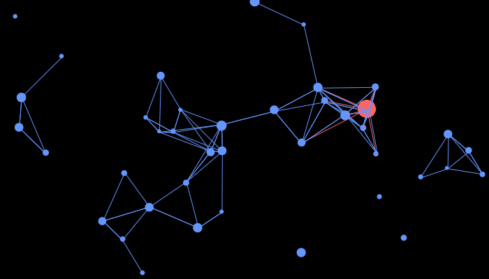

# Old Stuff 1

Some old p5js misc stuff, not all of it.

## Flaping Origami


```javascript
var size;
var bound;

function setup() {
  createCanvas(400, 400);
  size = 100;
  bound = 150;
  mouseX = width / 2;
  mouseY = height / 2;
  background(0);
}

function draw() {
  if (
    mouseX > width / 2 - bound &&
    mouseX < width / 2 + bound &&
    mouseY > height / 2 - bound &&
    mouseY < height / 2 + bound
  ) {
    fill(0);
    stroke("#00AAED");
    triangle(
      mouseX,
      mouseY,
      width / 2 + size,
      height / 2 + size,
      width / 2 - size,
      height / 2 + size
    );
  }
}

function mouseClicked() {
  background(0);
}
```

</details>

## Loutish quartz


```javascript
var cr, cg, cb, ca, qx, qy, qr;

function setup() {
  createCanvas(500, 500);
  background(0);

  rectMode(CENTER);

  strokeWeight(3);

  textSize(9);

  ca = 50;
  qr = 0;
}

function draw() {
  //background(0);

  if (mouseIsPressed) {
    qr = qr + 0.1;
  } else {
    qr = qr;
  }

  push();
  translate(width / 2, height / 2);
  rotate(qr);
  quartz();
  pop();

  vars();

  push();
  fill(0, 200, 0);
  text(" red:     " + cr, 10, 20);
  text(" green:   " + cg, 10, 30);
  text(" blue:    " + cb, 10, 40);
  text(" quartzX: " + qx, 10, 50);
  text(" quartzY: " + qy, 10, 60);
  text(" quartzR: " + round(qr), 10, 70);
  pop();
}

function quartz() {
  stroke(cr, cg, cb);
  fill(cr, cg, cb, ca);
  rect(0, 0, mouseX, mouseY);
}

function vars() {
  cr = qx / 2;
  cg = qx / 2;
  cb = (qx + qy) / 4;

  qx = mouseX;
  qy = mouseY;
}
```

## Nervous Ball


```javascript
function setup() {
  createCanvas(400, 400);
  X = random(30, 370);
  Y = random(30, 370);

  Dx = true;
  Dy = true;

  Cr = (X + Y) / 2;
  Cg = Y / 2;
  Cb = (X / 2) * 1.5;

  Ss = false;

  S = 50;
}

function draw() {
  stroke(Cr - 20, Cg - 20, Cb - 20);
  fill(Cr, Cg, Cb);
  ellipse(X, Y, S, S);

  if (Dx == true) {
    X = X + random(1, 3);
  }
  if (Dx == false) {
    X = X - random(1, 7);
  }
  if (X > 385) {
    Dx = false;
  }
  if (X < 15) {
    Dx = true;
  }

  if (Dy == true) {
    Y = Y + random(1, 7);
  }
  if (Dy == false) {
    Y = Y - random(1, 10);
  }
  if (Y > 385) {
    Dy = false;
  }
  if (Y < 15) {
    Dy = true;
  }

  Cr = (X + Y) / 2;
  Cg = Y / 2;
  Cb = (X / 2) * 1.5;

  if (Ss == true) {
    S++;
  }
  if (Ss == false) {
    S--;
  }
  if (S > 75) {
    Ss = false;
  }
  if (S < 7) {
    Ss = true;
  }
}
```

## Pixel Caos (Yet Another Pixel Tool)


```javascript
//missing or corrupted original image

let modeC1 = 1;
let modeC2 = 1;

function preload() {
  img = loadImage("mad_lego.jpg");
}

function setup() {
  createCanvas(864, 480);
  noStroke();
  image(img, 0, 0);
  loadPixels();
  for (let i = 0; i < img; i++) {
    pixels[i + img] = pixels[i];
  }
  updatePixels();
}

function draw() {
  pixel = get(mouseX, mouseY);
  noStroke();
  fill(pixel);
}

function mouseDragged() {
  mode1();
  mode2();

  //console.log("mode spacing = " + modeC1)
  //console.log("mode size = " + modeC2)
  //console.log("key = " + keyCode)
}

function keyPressed() {
  if (keyCode === 49) {
    modeC1 = modeC1 + 1;
  }
  if (keyCode === 50) {
    modeC2 = modeC2 + 1;
  }
}

function mode1() {
  if (modeC1 === 1) {
    X = mouseX;
    Y = mouseY;
  } else if (modeC1 === 2) {
    X = mouseX - (mouseX % 30);
    Y = mouseY - (mouseY % 30);
  } else if (modeC1 === 3) {
    X = mouseX - (mouseX % 20);
    Y = mouseY - (mouseY % 20);
  } else if (modeC1 === 4) {
    X = mouseX - (mouseX % 10);
    Y = mouseY - (mouseY % 10);
  } else if (modeC1 === 5) {
    X = mouseX - (mouseX % 100);
    Y = mouseY - (mouseY % 10);
  } else {
    modeC1 = 1;
  }
}

function mode2() {
  if (modeC2 === 1) {
    rect(X, Y, random(5, 10), random(5, 10));
  } else if (modeC2 === 2) {
    rect(X, Y, 30, 30);
  } else if (modeC2 === 3) {
    rect(X, Y, 20, 20);
  } else if (modeC2 === 4) {
    rect(X, Y, 10, 10);
  } else if (modeC2 === 5) {
    rect(X, Y, 250, 10);
  } else {
    modeC2 = 1;
  }
}
```

## Pixel Tool Version (I don't Know)


```javascript
/*
Using old library of p5.js ->
Why? In the current library pixels aren't getting updated while the mouse is being dragged.
*/

let img;
let pixel;
let brush_setup;
let X, Y;

function preload() {
  img = loadImage("blue.png");
}

function setup() {
  frameRate(10);
  createCanvas(img.width, img.height);

  image(img, 0, 0);

  loadPixels();
  for (let i = 0; i < img; i++) {
    pixels[i + img] = pixels[i];
  }
  updatePixels();

  brush_setup = 1;

  noStroke();

  print("Brush Setup: ", brush_setup);
}

function draw() {
  pixel = get(mouseX, mouseY);
  fill(pixel);
}

function mouseDragged() {
  brush_change();
}

function keyPressed() {
  if (keyCode === "a" || "A") {
    brush_setup = brush_setup + 1;
    print("Brush Setup: ", brush_setup);
  }
}

function brush_change() {
  if (brush_setup === 1) {
    X = mouseX - (mouseX % 5);
    Y = mouseY - (mouseY % 5);
    rect(X, Y, 5, 5);
  } else if (brush_setup === 2) {
    X = mouseX - (mouseX % 10);
    Y = mouseY - (mouseY % 10);
    rect(X, Y, 10, 10);
  } else if (brush_setup === 3) {
    X = mouseX - (mouseX % 15);
    Y = mouseY - (mouseY % 15);
    rect(X, Y, 15, 15);
  } else if (brush_setup === 4) {
    X = mouseX - (mouseX % 20);
    Y = mouseY - (mouseY % 20);
    rect(X, Y, 20, 20);
  } else if (brush_setup === 5) {
    X = mouseX - (mouseX % 5);
    Y = mouseY - (mouseY % 5);
    rect(X, Y, 4, 4);
  } else if (brush_setup === 6) {
    X = mouseX - (mouseX % 10);
    Y = mouseY - (mouseY % 10);
    rect(X, Y, 8, 8);
  } else if (brush_setup === 7) {
    X = mouseX - (mouseX % 15);
    Y = mouseY - (mouseY % 15);
    rect(X, Y, 12, 12);
  } else if (brush_setup === 8) {
    X = mouseX - (mouseX % 20);
    Y = mouseY - (mouseY % 20);
    rect(X, Y, 16, 16);
  } else if (brush_setup === 9) {
    X = mouseX - (mouseX % 30);
    Y = mouseY - (mouseY % 30);
    rect(X, Y, 24, 24);
  } else if (brush_setup === 10) {
    X = mouseX - (mouseX % 40);
    Y = mouseY - (mouseY % 40);
    rect(X, Y, 32, 32);
  } else {
    brush_setup = 1;
  }
}
```

## Sparkling Sky



```javascript
new p5();

var nr = 50;
var nrShow = 10;

X = new float(nr);
Y = new float(nr);

Xx = new float(nr);
Yy = new float(nr);

velX = new float(nr);
velY = new float(nr);

size = new float(nr);

function setup() {
  createCanvas(700, 400);

  mouseX = width / 2;
  mouseY = height / 2;

  for (i = 0; i < nr; i++) {
    X[i] = random(width);
    Y[i] = random(height);
    velX[i] = random(-2, 2);
    velY[i] = random(-2, 2);
    size[i] = random(5, 15);
  }
}

function draw() {
  if (nrShow >= nr - 10) {
    nrShow = nr - 10;
  }
  if (nrShow <= 10) {
    nrShow = 10;
  }
  if (mouseY < height / 4) {
    nrShow++;
  }
  if (mouseY > (height / 4) * 3) {
    nrShow--;
  }
  background(0);

  for (i = 0; i < nrShow; i++) {
    X[i] = X[i] + velX[i];
    Y[i] = Y[i] + velY[i];

    if (X[i] > width) {
      X[i] = 1;
    }
    if (X[i] < 0) {
      X[i] = width;
    }
    if (Y[i] > height) {
      Y[i] = 1;
    }
    if (Y[i] < 0) {
      Y[i] = height;
    }

    fill(100, 150, 255);
    noStroke();
    ellipse(X[i], Y[i], size[i], size[i]);

    fill(255, 100, 100);
    noStroke();
    ellipse(mouseX, mouseY, 25, 25);
    distance2 = dist(mouseX, mouseY, X[i], Y[i]);
    if (distance2 < size[i] * 9) {
      stroke(255, 100, 100);
      line(mouseX, mouseY, X[i], Y[i]);
    }

    angle = atan2(mouseX - X[i], mouseY - Y[i]);
    newX = cos(angle) * velX[i] + X[i];
    newY = sin(angle) * velY[i] + Y[i];
    X[i] = newX;
    Y[i] = newY;
  }

  for (i1 = 0; i1 < nrShow; i1++) {
    for (i2 = 0; i2 < nrShow; i2++) {
      distance1 = dist(X[i1], Y[i1], X[i2], Y[i2]);
      if (distance1 < size[i1] * 7) {
        push();
        stroke(100, 150, 255);
        line(X[i1], Y[i1], X[i2], Y[i2]);
        pop();
      }
    }
  }
}
```

## Square Star Up


```javascript
var rx, ry, rr, star, count;

function setup() {
  frameRate(10);
  createCanvas(400, 400);
  background(0);

  rectMode(CORNER);

  rx = width / 2;
  ry = height / 2;

  rr = 0;

  star = 5; //change value here

  textSize(9);

  count = 0;
}

function keyPressed() {
  if (keyCode === UP_ARROW) {
    star++;
    count = 0;
    background(0);
  } else if (keyCode === DOWN_ARROW) {
    star--;
    count = 0;
    background(0);
  }
}

function draw() {
  if (star <= 1) {
    star = 2;
  }

  push();
  noFill();
  strokeWeight(3);
  //stroke(20, 100, 150);
  stroke(random(50, 200), random(50, 200), random(50, 200));
  translate(rx, ry);
  rr = rr + PI / star;
  rotate(rr);
  rect(0, 0, 100, 100);
  pop();

  push();
  fill(0);
  rect(0, 0, 50, 50);
  fill(20, 100, 150);
  text("count: " + count, 10, 20);
  text("star:  " + star, 10, 30);
  pop();

  if (count < star * 2) {
    count++;
  }
}
```

## Tripy Lines


```javascript
function setup() {
  createCanvas(400, 400);
  frameRate(15);
  space = 10;
  x = 0;
  y = 0;
  sizeX = width;
  sizeY = height;
  s1 = 3;
  grow1 = true;
  s2 = 3;
  grow2 = true;
}

function draw() {
  background(0);

  for (i = 0; i < sizeY; i = i + space) {
    push();
    strokeWeight(s1);
    stroke(50, 50, 200);
    line(x + sizeX / 2, y + 5 + i, x + sizeX, y + 5 + i);
    if (grow1 == true) {
      s1++;
    }
    if (grow1 == false) {
      s1--;
    }
    if (s1 > 6) {
      grow1 = false;
      s1 = 6;
    }
    if (s1 < 0) {
      grow1 = true;
      s1 = 0;
    }
    pop();
  }

  for (i = 0; i < sizeY; i = i + space) {
    push();
    strokeWeight(s2);
    stroke(200, 50, 50);
    line(x, sizeY - 5 - i, x + sizeX / 2, sizeY - 5 - i);
    if (grow2 == true) {
      s2--;
    }
    if (grow2 == false) {
      s2++;
    }
    if (s2 > 6) {
      grow2 = true;
      s2 = 6;
    }
    if (s2 < 0) {
      grow2 = false;
      s2 = 0;
    }
    pop();
  }
}
```

## Weird Clock


```javascript
function setup() {
  frameRate(60);
  createCanvas(400, 400);
  angleMode(DEGREES);
}

function draw() {
  background(0);
  translate(200, 200);
  noFill();

  let hr = hour();
  let mn = minute();
  let sc = second();

  strokeWeight(15);

  rotate(-65);
  stroke(91, 192, 235);
  let endsc = map(sc, 0, 60, 0, 360);
  arc(0, 0, 250, 250, 0, endsc);
  stroke(91, 192, 235, 75);
  line(-50, 0, 150, 0);

  rotate(45);
  stroke(253, 231, 76);
  let endmn = map(mn, 0, 60, 0, 360);
  arc(0, 0, 215, 215, 0, endmn);
  stroke(253, 231, 76, 75);
  line(-40, 0, 160, 0);

  rotate(45);
  stroke(195, 66, 63);
  let endhr = map(hr % 12, 0, 12, 0, 360);
  arc(0, 0, 180, 180, 0, endhr);
  stroke(195, 66, 63, 75);
  line(-30, 0, 170, 0);
}
```
